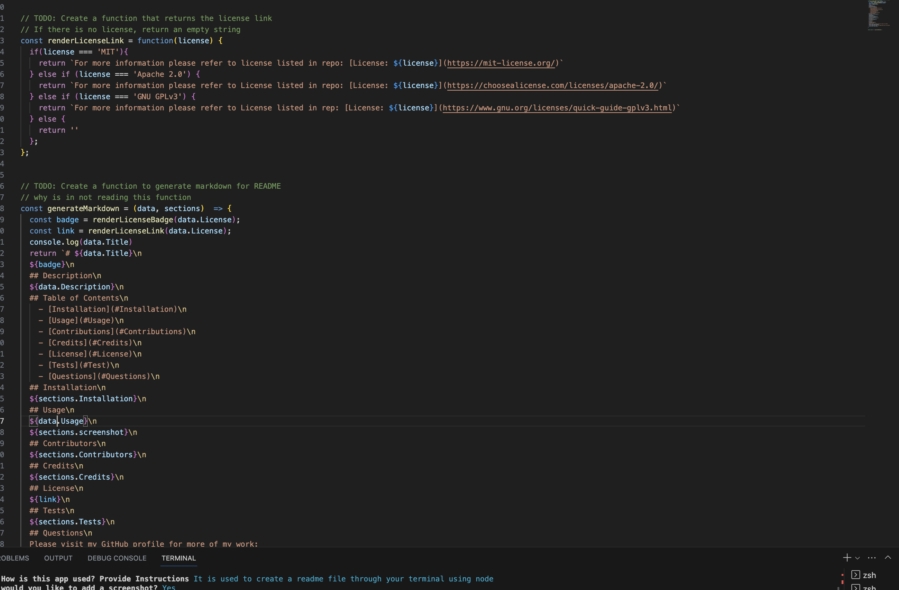

# ReadMe Generator

  

  ## Description

  I built this project to be more efficient. If we are being honest there is way to much on the format of readme file for anyone to remember. With this project, you don't have to . This project also allows you to udnerstand node better and the importance of git ignores/ modules.

  ## Table of Contents

    - [Installation](#installation)

    - [Usage](#usage)

    - [Contributions](#contributions)

    - [Credits](#credits)

    - [License](#license)

    - [Tests](#test)

    - [Questions](#questions)

  ## Installation

  -to install this application you first need to run npm init into your terminal and the install the inquirer package 8.2.4

  ## Usage

  This app provides generated readme files through your terminal

  

  [this is the real video to the screencastify][https://drive.google.com/file/d/1PL7dwEqNbjbg2CBTSs8cZiqCqTunH2tj/view]

  ## Contributors

  []undefined

  ## Credits

  https://stackoverflow.com/questions/39621088/node-js-inquirer-is-there-a-way-to-prompt-for-an-user-defined-size-array
  https://www.npmjs.com/package/inquirer/v/8.2.4
  bootcamp spot zoom video

  ## License

  For more information please refer to license listed in repo: [License: MIT](https://mit-license.org/)

  ## Tests

  you can test this app by opening up your terminal, running node index.js, and following the questions that prompt you.

  ## Questions

  Please visit my GitHub profile for more of my work:
  [Abigail Garcia](https://github.com/abigailmgarcia)

  For any questions about this application you can contact:
  [Abigail Garcia](mailto:abigailmg31@gmail.com)
